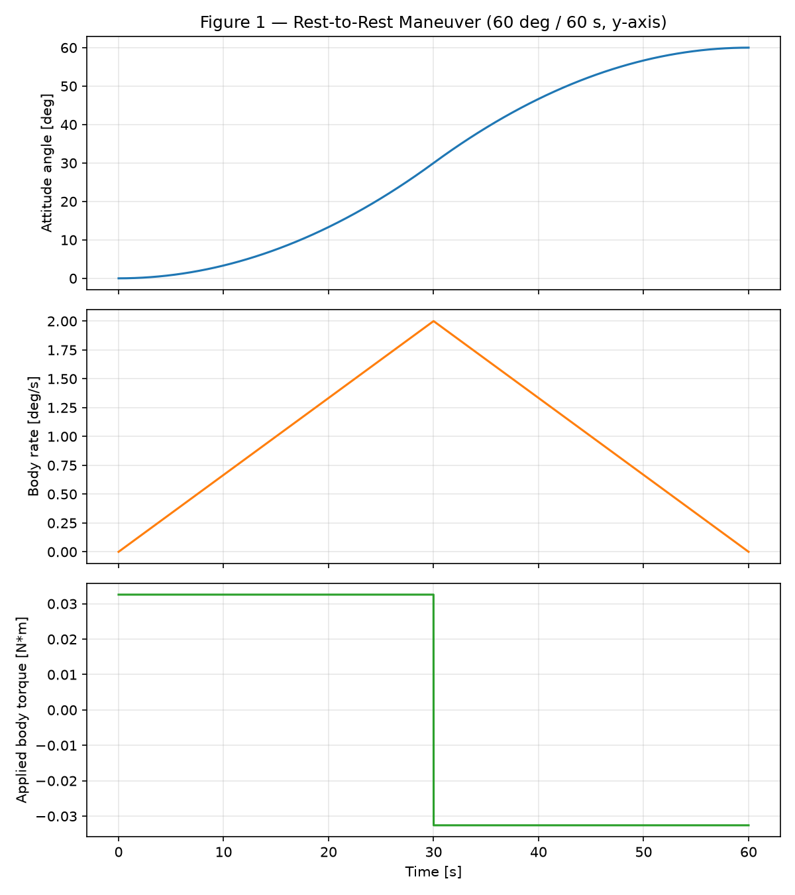
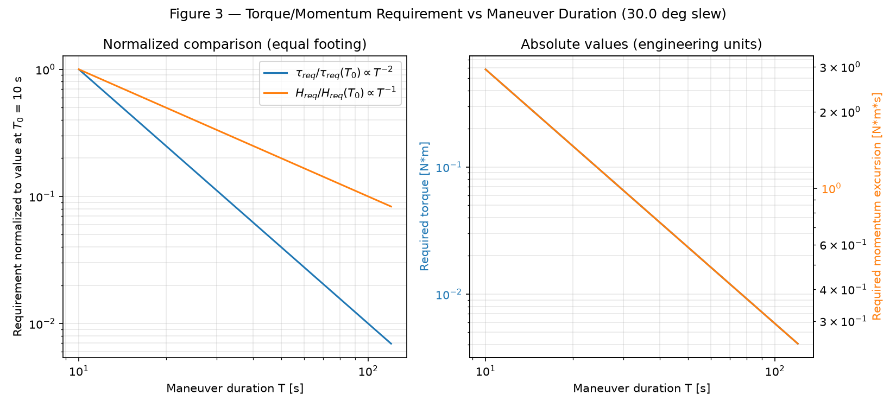
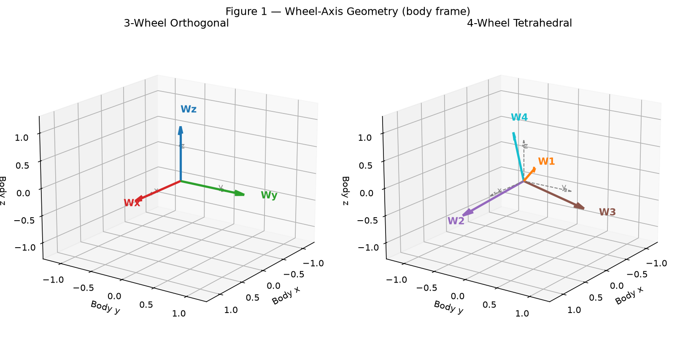
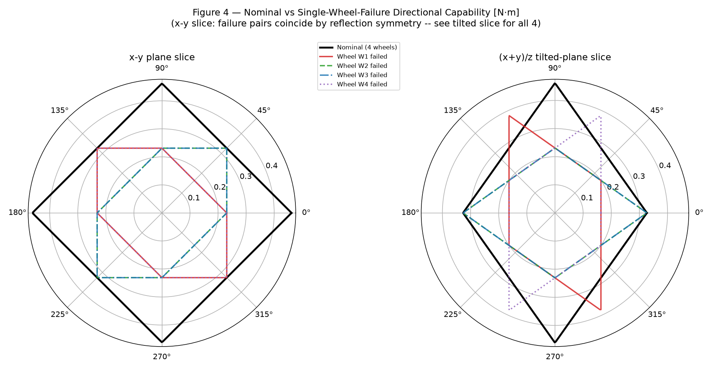
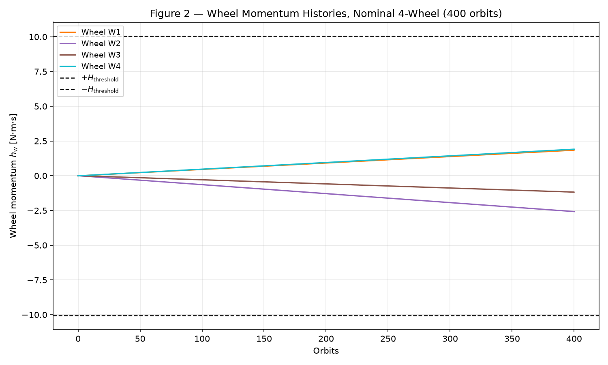
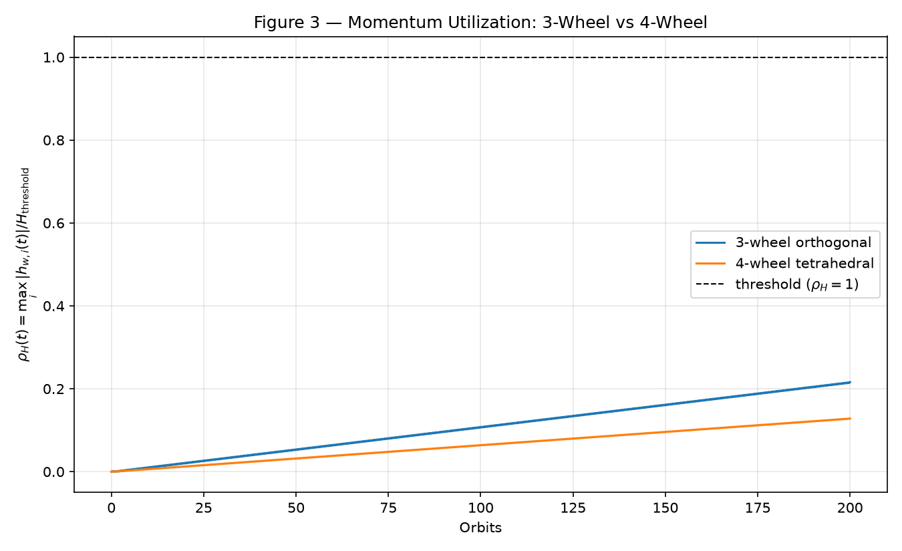
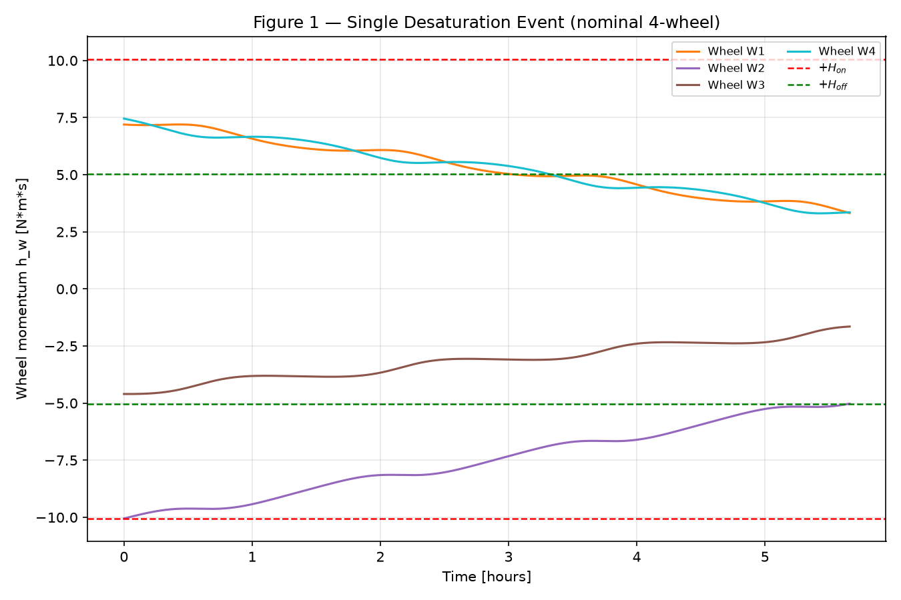
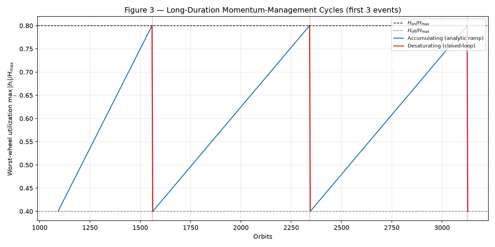
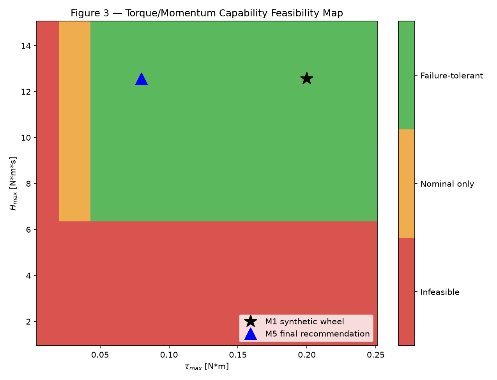
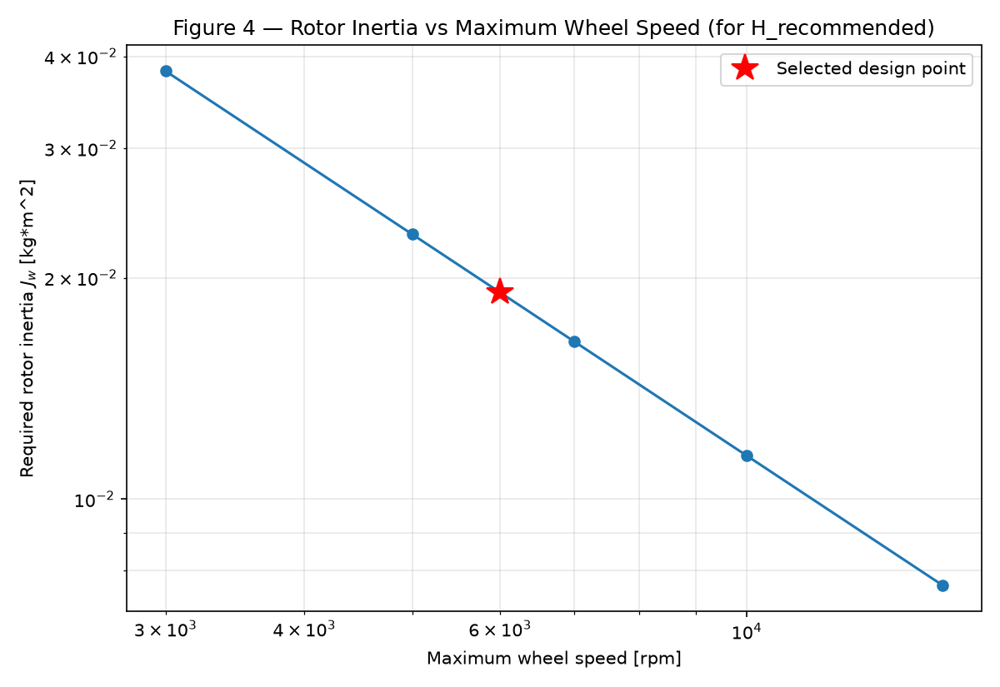

# GNC-04 — Reaction Wheel Sizing & Momentum Management

A systems-level reaction-wheel sizing and momentum-management study for a
representative small spacecraft: from maneuver-driven torque/momentum
requirements, through multi-wheel geometry and redundancy, environmental
disturbance accumulation, magnetorquer desaturation, to a final
robustness-checked capability recommendation. Every result is derived
and independently verified — analytically, numerically, and by
regression test — not assumed.

**Status: technically complete (Milestones 1–5).** 239 automated tests,
five reproducible analysis scripts, and a single coherent final
recommendation. This is a personal engineering-methods project, not a
mission design; every environmental, hardware, and threshold assumption
is explicitly labeled representative unless a value is a cited physical
constant.

## Engineering objective

> **What reaction-wheel torque, momentum-storage, speed, and rotor-inertia
> capability should a small spacecraft's reaction-wheel set be sized for,
> once maneuver requirements, wheel geometry, redundancy, environmental
> disturbance accumulation, desaturation operations, and engineering
> margins are all considered together — and how often must it be
> desaturated?**

This is a **reaction-wheel sizing and momentum-management** study, not an
attitude-controller-design project. Closed-loop control appears only
insofar as an open-loop, bang-bang rest-to-rest slew profile is needed to
drive actuator sizing.

## Final recommendation

The project's principal deliverable — derived from the complete pipeline
below, not assumed or fitted to a convenient number (see
[`docs/final_sizing_methodology.md`](docs/final_sizing_methodology.md)
for the full derivation, including a real margin-compounding bug caught
and fixed by the robustness check):

| Quantity | Final result |
|---|---:|
| Architecture | **4-wheel tetrahedral** |
| Adopted design maneuver | 90° / 60 s about the worst-inertia axis |
| Nominal per-wheel torque required | 0.021 N·m |
| One-wheel-failure torque required | 0.042 N·m |
| **Recommended wheel torque capability** | **≥ 0.08 N·m** |
| **Recommended momentum storage capacity** | **≈ 12.6 N·m·s** |
| **Recommended maximum wheel speed** | **≈ 6000 rpm** |
| **Recommended rotor inertia** | **≈ 0.020 kg·m²** |
| Maximum stored rotor energy | ≈ 3950 J |
| Dump-on threshold $H_{\rm on}$ | ≈ 10.05 N·m·s |
| Dump-off threshold $H_{\rm off}$ | ≈ 5.03 N·m·s |
| Desaturation repeat interval | ≈ 51 days (779 orbits) |
| Desaturation dump duration | ≈ 5.7 h (3.6 orbits) |
| Desaturation duty cycle | < 0.5% |
| Representative dumps/year (steady state) | ≈ 7 |

These are **systems-level sizing requirements based on representative
assumptions**, not manufacturing tolerances or a procurement
specification — see [Assumptions and limitations](#assumptions-and-limitations).
No commercial hardware was selected; the deliverable is the independently
derived requirement itself.

## Representative spacecraft and requirements

Illustrative engineering assumptions, not a specific spacecraft — a
~180 kg smallsat-class bus with an asymmetric diagonal inertia tensor,
validated at construction for finiteness, strict positivity, and
positive-definiteness ([`spacecraft.py`](src/reaction_wheel/spacecraft.py)):

| Axis | Inertia [kg·m²] |
|---|---|
| $I_x$ | 18.0 |
| $I_y$ | 28.0 |
| $I_z$ | 22.0 |

Governing relations (full derivations and frozen sign/frame conventions:
[`docs/conventions.md`](docs/conventions.md),
[`docs/wheel_sizing_methodology.md`](docs/wheel_sizing_methodology.md)):

$$H_w = J_w\Omega_w \qquad H_{\max} = J_w\Omega_{\max} \qquad \dot\Omega_w = \tau_w/J_w$$

$$\alpha = \frac{4\theta}{T^2} \qquad \tau_{\rm req} = I\alpha \qquad \omega_{\rm peak} = \frac{2\theta}{T} \qquad H_{\rm req} = I\,\omega_{\rm peak}$$

$$\tau_{\rm req}\propto\theta/T^2 \qquad H_{\rm req}\propto\theta/T$$

Torque and momentum-storage are **independent actuator requirements**
that do not scale the same way with maneuver duration — one of the
project's recurring findings (§ [Key engineering findings](#key-engineering-findings)).

### The two maneuver cases — do not confuse them

| | Angle / duration | Role |
|---|---|---|
| **M1 stress/verification case** | 45° / 10 s | Built *only* to demonstrate that torque and momentum are independent constraints (it exceeds the M1 synthetic wheel's torque capability while remaining momentum-feasible). **Never an operational requirement.** Retained throughout M2–M5 for comparison only. |
| **Adopted design maneuver (M5)** | 90° / 60 s, worst-inertia axis | The actual sizing driver for the final recommendation — a plausible routine reorientation. |

The final 0.08 N·m wheel does **not** satisfy the 45°/10 s stress case
(4.8×–9.5× over capacity) — this is an accepted, explicitly reported
consequence of sizing to the real adopted requirement, not a design
failure. See [M5](#m5--robust-final-sizing) and
[Assumptions and limitations](#assumptions-and-limitations).

## M1 — Maneuver sizing

`scripts/verify_wheel_sizing.py` — spacecraft/wheel summary, a 15-row
maneuver-sizing table (5 cases × 3 axes), analytical-vs-numerical
verification, total-angular-momentum conservation, and scaling-law checks.

| Check | Result |
|---|---|
| Analytical vs. numerical peak momentum | residual ≈ 2.4×10⁻⁴ N·m·s |
| Total angular momentum conservation | max\|H_total\| ≈ 4.6×10⁻¹⁵ N·m·s |
| Angle-doubling scaling law (τ, H) | exactly 2.0000, 2.0000 |
| Time-doubling scaling law (τ, H) | exactly 0.2500, 0.5000 |

Full table: [`results/maneuver_sizing_table.md`](results/maneuver_sizing_table.md),
checked against a synthetic verification wheel ($J_w=0.02$ kg·m²,
$\tau_{\max}=0.2$ N·m, $\Omega_{\max}=6000$ rpm — used only to exercise
the mechanics in M1–M4, superseded by the M5 final recommendation above).

**Peak-torque and peak-momentum driver**: the 45°/10 s stress case about
$I_y$ — 0.880 N·m required, *exceeding* the verification wheel's torque
capability ($\rho_\tau=4.40$) while comfortably satisfying momentum
($\rho_H=0.35$): a same-maneuver, different-constraint demonstration.
Doubling maneuver time cuts torque demand 4× but momentum demand only 2×.




## M2 — Wheel geometry and redundancy

`scripts/analyze_wheel_geometry.py` — full derivation:
[`docs/wheel_geometry_methodology.md`](docs/wheel_geometry_methodology.md).

**3-wheel orthogonal** ($A_3=I_3$) vs. **4-wheel tetrahedral**
(axes $\propto[1,1,1],[1,-1,-1],[-1,1,-1],[-1,-1,1]$, each normalized — a
symmetric *tight frame*, $A_4A_4^T=\tfrac43 I_3$, with a 1-D null space).

| Geometry | $\tau_{\min}$ [N·m] | $\tau_{\max,\rm cap}$ [N·m] | $\eta=\tau_{\min}/\tau_{\max,\rm cap}$ | $\kappa$ |
|---|---|---|---|---|
| 3-wheel orthogonal | 0.200 | 0.341 | 0.587 | 1.0 |
| 4-wheel tetrahedral (nominal) | 0.267 | 0.455 | 0.587 | 1.0 |

**Isotropy vs. absolute capability — two distinct concepts.** Both
geometries have identical condition number ($\kappa=1$, uniform
allocation sensitivity in every direction) and identical isotropy ratio
($\eta\approx0.587$, i.e. the *same directional shape*): neither is more
or less direction-dependent than the other. But the tetrahedral
geometry's envelope is uniformly **4/3× larger in absolute size**, a
direct consequence of its tight-frame scaling — $\kappa=1$ for both says
nothing about which one can produce more torque; that is a separate,
independently computed quantity.

**Single-wheel failure**: every one of the 4 possible failures leaves the
remaining 3-wheel subset full rank — **full 3-axis control authority is
retained** — but capability drops from 0.267 to a mean 0.163 N·m, a
**38.8% loss relative to nominal 4-wheel capability**, and *below* the
plain 3-wheel baseline. **Retaining rank (control authority) and
retaining nominal torque capability are not the same claim**: a program
requiring one-wheel-fault tolerance must size against the failed-case
capability, not the nominal number.




## M3 — Environmental momentum accumulation

`scripts/analyze_momentum_accumulation.py` — full derivation and
parameter-by-parameter rationale:
[`docs/momentum_accumulation_methodology.md`](docs/momentum_accumulation_methodology.md).
**All disturbance models here are representative engineering
approximations, not a high-fidelity mission environmental model**,
except where a value is a cited physical constant (e.g. solar pressure
at 1 AU).

Representative 500 km circular LEO ($T_{\rm orb}=94.6$ min): SRP +
aerodynamic + magnetic-mean secular bias, plus orbit-periodic
gravity-gradient and magnetic-direction oscillation.

**Dominant drivers are NOT the same disturbance** — one of the project's
strongest systems-level findings:

| | Component | Magnitude |
|---|---|---|
| Dominant **secular** (accumulation) driver | Aerodynamic drag | mean $1.91\times10^{-6}$ N·m |
| Dominant **peak-torque** driver | Gravity-gradient | peak $1.84\times10^{-5}$ N·m (near-zero orbital mean) |

| Configuration | Orbits to threshold | Days to threshold |
|---|---|---|
| 3-wheel orthogonal | 926.0 | 60.8 |
| 4-wheel tetrahedral (nominal) | 1558.5 | 102.4 |
| 4-wheel, one wheel failed (mean) | ~999 | ~65.7 |

The mean-torque analytical estimate matches full numerical integration to
**0.03%** *for this specific environment and timescale* — this validated
agreement is not claimed to generalize automatically to an arbitrary
periodic/secular disturbance mix (see the doc's §10 for the tested scope).




## M4 — Momentum desaturation

`scripts/analyze_desaturation.py` — full derivation:
[`docs/desaturation_methodology.md`](docs/desaturation_methodology.md).

**Magnetorquer physics**: $\boldsymbol\tau_m = \mathbf m\times\mathbf B$,
and therefore $\boldsymbol\tau_m\cdot\mathbf B\equiv0$ **always** — a
magnetorquer cannot instantaneously produce torque parallel to the local
field; it is a 2-axis, not a 3-axis, actuator at any single instant.
Full authority over an orbit comes only from the field direction rotating
relative to the body as the representative synthetic magnetorquer
($m_{\max}=20$ A·m², not a commercial product) sweeps through it.

**Unloading-law sign, derived not guessed**: the correct proportional
momentum-feedback law is $\boldsymbol\tau_{\rm unload}=+k_H\boldsymbol
H_w^{\rm body}$ — the *opposite* sign from a naive "point it against the
stored momentum" reading, verified numerically to give clean exponential
decay rather than runaway growth (see the doc's §1). A direct, load-bearing
consequence of that same derivation: **external unloading can only ever
remove the body-observable momentum $A\mathbf h_w$ — it structurally
cannot touch a null-space wheel-momentum imbalance.** Internal
null-space redistribution (`geometry`'s 1-D null space, M2) leaves
$A\mathbf h_w$ exactly unchanged (verified to $<10^{-9}$ N·m·s) and
**cannot, by itself, remove any spacecraft angular momentum** — only the
external magnetorquer torque does that (17.50→8.18 N·m·s over one dump
in the worked example). Redistribution and desaturation are not the same
operation.

Thresholds: $H_{\rm on}=0.8H_{\max}=10.053$, $H_{\rm off}=0.4H_{\max}=
5.027$ N·m·s.

| Configuration | Dump duration | Repeat interval | Duty cycle |
|---|---|---|---|
| 3-wheel orthogonal | 1.97 orbits | 463.0 orbits | 0.423% |
| 4-wheel tetrahedral (nominal) | 3.59 orbits | 779.3 orbits | 0.459% |
| 4-wheel, any one wheel failed | 1.93–2.53 orbits | 447–650 orbits | — |

Baseline dump duration (3.59 orbits, 5.66 h) is ~15× the idealized
unsaturated estimate because the commanded dipole is saturated at
$m_{\max}$ for nearly the whole dump and mean field-geometry
effectiveness is only 0.76 — reported honestly, not idealized away.

*A note on annual dump count*: this section's schedule simulation
(starting from zero wheel momentum) counts **6 dumps** in year one,
because the first cycle includes a long zero-to-$H_{\rm on}$ charge-up.
M5 reports a **steady-state** rate of ~7.1/year (365 days ÷ one full
cycle, no start-up transient). Both are correct under their own
definition — see `docs/desaturation_methodology.md` §8 for the
reconciliation.




## M5 — Robust final sizing

`scripts/final_sizing_study.py` — full derivation:
[`docs/final_sizing_methodology.md`](docs/final_sizing_methodology.md).

**Requirement traceback** (every final number traces back to a physical
requirement, never an arbitrary round figure):

$$\text{adopted maneuver (90°/60s)} \to \text{body torque/momentum}
\to \text{tetrahedral allocation} \to \text{nominal \& 1-wheel-failure
per-wheel requirement} \to \text{maneuver-at-threshold headroom check}
\to \text{robust corner case} \to \text{final capability}$$

| | Nominal | 1-wheel failure | Penalty |
|---|---|---|---|
| Per-wheel torque | 0.0212 N·m | 0.0423 N·m | **+100%** |

Fault tolerance roughly *doubles* the per-wheel torque requirement for
this maneuver (spreading the same body torque across 3 surviving wheels
instead of 4). **The robust corner case (+20% spacecraft-inertia
uncertainty, one wheel failed, adopted maneuver, selected 1.5× margins)
failed against the plain margined sizing** — a genuine result, not
smoothed over — and in checking it, a real bug was caught: applying
momentum margin to the *entire* (pre-existing-threshold + excursion) sum
made the required-$H_{\max}$ equation mathematically diverge (no finite
solution once $SF_H\cdot f_{\rm on}\ge1$, true here at $1.5\times0.8=1.2$).
Fixed by applying margin to the excursion only — the same convention
already used for the plain headroom check — after which the escalated
final wheel **passes** the robust case exactly (regression-tested:
`test_robust_corner_case_margin_applies_only_to_excursion_not_
preexisting_threshold`).

The escalated final momentum capacity (12.566 N·m·s) turns out to
converge almost exactly to the original M1 synthetic verification
wheel's value — **a derived convergence, not an inherited assumption**:
it comes from $J_w=0.020$ kg·m² (rounded up from an independently solved
0.0191 kg·m² requirement) at 6000 rpm, re-derived from the robust-case
momentum requirement, not copied forward from M1.

**Sensitivity findings**: torque/momentum scale exactly as $T^{-2}$/$T^{-1}$
with maneuver time and linearly with spacecraft inertia. **Disturbance
magnitude and magnetorquer capability change operations (dump frequency,
dump duration) but never change wheel sizing** *for this specific
environment and sizing logic* — the representative disturbance is far
weaker, and the magnetorquer far more independent, than the
maneuver-driven torque/momentum requirement; this is not claimed as a
universal result.

**Architecture decision, from evidence**: 4-wheel tetrahedral. The
fault-tolerance torque penalty is small in absolute terms (0.042 N·m,
well within the final 0.08 N·m capability); the 3-wheel alternative
offers **zero** recovery from any single wheel failure — an entire
control axis is lost outright. A concurrency check confirms the robust
case does not combine physically incompatible conditions (inertia
uncertainty and a wheel failure can coexist; a simultaneous *aggressive*
maneuver was deliberately excluded from that case, since the aggressive
case was never adopted as a requirement — see the doc's concurrency
discussion).




## Key engineering findings

- **Torque and momentum-storage are independent actuator requirements**
  — the same maneuver can be momentum-feasible yet torque-infeasible (M1).
- **Maneuver time trades asymmetrically**: $\tau_{\rm req}\propto T^{-2}$
  vs. $H_{\rm req}\propto T^{-1}$ — slowing a maneuver relieves torque
  far faster than it relieves momentum (M1, M5).
- **Redundancy changes per-wheel allocation, not just failure survival**
  — 4 wheels roughly halve nominal worst-wheel torque vs. 3 wheels for
  the same body torque (M2).
- **Retaining rank ≠ retaining nominal capability**: every tetrahedral
  single-wheel failure keeps full 3-axis authority, yet loses 38.8% of
  minimum directional torque capability (M2).
- **Isotropy (shape) and absolute capability (scale) are different
  metrics** — two geometries can share an isotropy ratio while differing
  4/3× in absolute envelope size (M2).
- **Peak instantaneous torque and long-term secular accumulation can
  have different physical origins** — gravity-gradient dominates peak
  torque, aerodynamic drag dominates secular momentum growth (M3).
- **A magnetorquer is fundamentally a 2-axis actuator at any instant**
  ($\boldsymbol\tau_m\cdot\mathbf B\equiv0$); full authority over time
  comes only from the field's orbital rotation (M4).
- **Internal null-space redistribution cannot remove spacecraft angular
  momentum** — only an external torque changes the body-observable
  momentum that redistribution structurally cannot touch (M2, M4).
- **A margin formula can silently diverge** if applied to a
  self-referential threshold instead of the raw excursion — caught by a
  deterministic robustness check, not assumed safe (M5).
- **Environmental disturbance and magnetorquer capability drive
  operations (how often/how long to desaturate), not hardware sizing**
  (how big the wheels must be) — for this representative spacecraft and
  environment (M5).

## Verification and tests

239 automated tests across physics-level checks (not just API smoke
tests): analytical-vs-numerical agreement, conservation laws, scaling
laws, allocation reconstruction, sign-convention regressions, hysteresis
chatter avoidance, and the margin-divergence regression above.

```bash
pytest -q
# 239 passed
```

Each milestone's script independently reproduces its own numbers; run
all five in sequence (below) to regenerate every figure and table in
`results/` from scratch.

## Repository structure

```
reaction-wheel-sizing/
├── README.md
├── pyproject.toml
├── src/reaction_wheel/
│   ├── constants.py       # unit conversions (rpm <-> rad/s, deg <-> rad)
│   ├── spacecraft.py       # rigid spacecraft inertia model
│   ├── wheel.py            # ideal reaction-wheel mechanics model
│   ├── maneuvers.py        # rigid-body torque/momentum + triangular slew
│   ├── sizing.py           # reusable maneuver-driven sizing API
│   ├── geometry.py         # multi-wheel geometry, allocation, capability (M2)
│   ├── disturbances.py     # environmental disturbance torque models (M3)
│   ├── momentum.py         # wheel-space allocation, momentum integration, saturation time (M3)
│   ├── desaturation.py     # magnetorquer unloading, hysteresis, schedule simulation (M4)
│   └── final_sizing.py     # integrated requirement hierarchy, margins, robustness, recommendation (M5)
├── tests/                  # pytest suite (239 tests)
├── scripts/
│   ├── verify_wheel_sizing.py           # M1 verification report + figures + table
│   ├── analyze_wheel_geometry.py        # M2 analysis report + figures + table
│   ├── analyze_momentum_accumulation.py # M3 analysis report + figures + tables
│   ├── analyze_desaturation.py          # M4 analysis report + figures + tables
│   └── final_sizing_study.py            # M5 integrated sizing report + figures + tables
├── docs/
│   ├── conventions.md                       # frozen sign/unit/frame conventions
│   ├── wheel_sizing_methodology.md          # M1 derivations + verification approach
│   ├── wheel_geometry_methodology.md        # M2 geometry/allocation/redundancy methodology
│   ├── momentum_accumulation_methodology.md # M3 disturbance/momentum/saturation methodology
│   ├── desaturation_methodology.md          # M4 magnetorquer/hysteresis/schedule methodology
│   └── final_sizing_methodology.md          # M5 requirement hierarchy, margins, robustness, final recommendation
└── results/                # every generated figure and table (superset of the curated set above)
```

## Reproducibility

```bash
python3 -m venv .venv
source .venv/bin/activate
pip install -e ".[dev]"
pytest -q
python scripts/verify_wheel_sizing.py
python scripts/analyze_wheel_geometry.py
python scripts/analyze_momentum_accumulation.py
python scripts/analyze_desaturation.py
python scripts/final_sizing_study.py
```

Each script is deterministic and regenerates its figures/tables in
`results/` from scratch; no cached or hand-edited output is committed
without a corresponding script that reproduces it.

## Assumptions and limitations

- No commercial reaction-wheel or magnetorquer selection was performed —
  the deliverable is the derived requirement, not a product choice; both
  remain synthetic capability models throughout.
- The adopted design maneuver (90°/60 s), engineering margins (1.5×),
  and robust corner case (+20% inertia, one wheel failed) are
  representative engineering choices, not derived from a specific
  mission requirements document or reliability policy.
- Rest-to-rest maneuver kinematics use an idealized bang-bang
  (triangular-rate) open-loop profile, not a closed-loop controller.
  Spacecraft inertia is diagonal (principal-axis); no products of inertia.
- M2–M5 allocation is unconstrained minimum-norm; infeasible demands are
  detected and reported, never silently clipped.
- The M2 null-space freedom is analyzed (an invariance proof and its role
  in why external unloading is required) but never implemented as an
  active redistribution control law.
- M3's disturbance models are simplified, illustrative approximations
  (SRP/aero direction fixed in body frame; gravity-gradient/magnetic
  periodicity from simplified geometric sweeps, not a real orbit/attitude
  or IGRF propagator).
- The mean-torque long-horizon approximation (M3) is validated to 0.03%
  for the specific environment and timescale tested — not claimed to
  generalize automatically to an arbitrary periodic/secular disturbance
  mix.
- M4's unloading law is a simple proportional feedback with no
  integral/derivative terms and no interaction with a real attitude
  controller (ideal attitude hold is assumed throughout).
- The final wheel does not satisfy the un-adopted 45°/10 s stress
  maneuver; if that maneuver is ever operationally required, the
  documented mitigation is an operational restriction, not silent
  hardware oversizing.
- This is a systems-level actuator-sizing study: no rotor stress/FEM,
  bearing design, motor electromagnetic design, wheel jitter, thermal, or
  power-system analysis.

## Project status

**Complete.** All five milestones are implemented, tested, cross-verified
against each other, and documented. The repository is reproducible from
a clean checkout via the commands above. No further engineering
milestone, hardware-selection, or new functionality is planned for this
project; a separate, optional commercial-hardware comparison against the
final derived requirement could be pursued independently in the future.

## License

[MIT](LICENSE)
