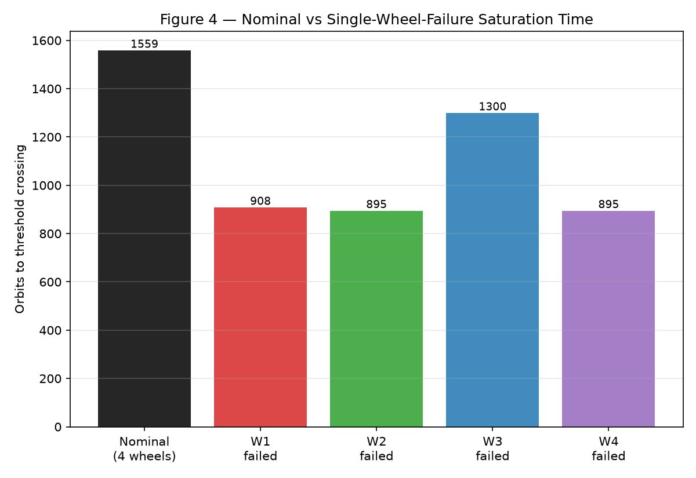

# GNC-04 — Reaction Wheel Sizing & Momentum Management

**Milestone 1: Reaction-Wheel Mechanics & Maneuver Torque Sizing**
**Milestone 2: 3-Axis Wheel-Set Geometry, Torque Allocation & Wheel Loading**
**Milestone 3: Environmental Disturbance Momentum Accumulation & Saturation-Time Analysis**
**Milestone 4: Momentum Dumping, Desaturation Logic & Operational Schedule**
**Milestone 5: Robust Wheel-Set Sizing, Capability Trades & Final Engineering Recommendation**

## Project objective

Build a rigorous, reproducible reaction-wheel sizing and
momentum-management analysis for a representative small spacecraft. The
final portfolio deliverable (across all milestones) is a sized
reaction-wheel set, a momentum-storage assessment, and a desaturation
schedule/strategy.

## Engineering problem

> **What reaction-wheel torque and momentum-storage capability are
> required to execute representative spacecraft attitude maneuvers while
> absorbing environmental disturbance momentum, and how frequently must
> the wheel set be desaturated?**

This is a **reaction-wheel sizing and momentum-management** project, not
an attitude-controller-design project. Controller design appears only
insofar as a physically defined maneuver torque profile (an open-loop,
bang-bang rest-to-rest slew) is needed to drive actuator sizing.

Milestone 1 establishes the foundational wheel mechanics and
single-axis maneuver-driven torque/momentum sizing, with independent
analytical and numerical verification. It does **not** yet cover 3-axis
wheel geometry, environmental disturbance torques, or momentum dumping —
those are later milestones (see [Planned next milestone](#planned-next-milestone)).

## Representative spacecraft

Illustrative engineering assumptions, not a specific spacecraft — a
~180 kg smallsat-class bus with an asymmetric diagonal inertia tensor:

| Axis | Inertia [kg·m²] |
|---|---|
| $I_x$ | 18.0 |
| $I_y$ | 28.0 |
| $I_z$ | 22.0 |

Validated at construction for finiteness, strict positivity, and
(diagonal) positive-definiteness — see [`spacecraft.py`](src/reaction_wheel/spacecraft.py).

## Governing equations

Wheel mechanics (wheel-frame convention):

$$H_w = J_w\Omega_w \qquad H_{\max} = J_w\Omega_{\max} \qquad \dot\Omega_w = \tau_w/J_w$$

Rest-to-rest triangular-rate slew of angle $\theta$ in time $T$
(body-torque convention):

$$\alpha = \frac{4\theta}{T^2} \qquad \tau_{\rm req} = I\alpha \qquad \omega_{\rm peak} = \frac{2\theta}{T} \qquad H_{\rm req} = I\,\omega_{\rm peak}$$

Scaling laws: $\tau_{\rm req}\propto\theta/T^2$, $H_{\rm req}\propto\theta/T$
— torque and momentum sizing are **different actuator requirements** that
do not scale the same way with maneuver time. Sign conventions (wheel
torque vs. body reaction torque, momentum conservation) are frozen in
[`docs/conventions.md`](docs/conventions.md); full derivations are in
[`docs/wheel_sizing_methodology.md`](docs/wheel_sizing_methodology.md).

## M1 verification

`scripts/verify_wheel_sizing.py` runs the full M1 report: spacecraft/wheel
summary, a 15-row maneuver-sizing table (5 cases × 3 axes), analytical-vs-
numerical residuals, total-angular-momentum conservation, and scaling-law
checks — then generates three figures.

| Check | Result |
|---|---|
| Analytical vs. numerical final angle | residual ≈ 1.4×10⁻¹⁰ rad |
| Analytical vs. numerical final rate | residual ≈ 4.6×10⁻¹² rad/s |
| Analytical vs. numerical peak momentum | residual ≈ 2.4×10⁻⁴ N·m·s |
| Torque-integration vs. momentum-requirement | residual ≈ 2.4×10⁻⁴ N·m·s |
| Total angular momentum conservation | max\|H_total\| ≈ 4.6×10⁻¹⁵ N·m·s |
| Angle-doubling scaling law (τ, H) | exactly 2.0000, 2.0000 |
| Time-doubling scaling law (τ, H) | exactly 0.2500, 0.5000 |

**Figures** (`results/`):

- `fig1_rest_to_rest_maneuver.png` — attitude angle, body rate, applied
  body torque for a 60°/60 s slew.
- `fig2_momentum_exchange.png` — spacecraft, wheel, and total angular
  momentum; total is flat at zero, visually confirming conservation.
- `fig3_torque_momentum_vs_duration.png` — required torque and momentum
  vs. maneuver duration, normalized on one axis to make the $T^{-2}$ vs.
  $T^{-1}$ slope difference directly visible, plus an absolute-units panel.

## Maneuver-sizing table

Full table: [`results/maneuver_sizing_table.md`](results/maneuver_sizing_table.md)
(5 representative maneuvers × 3 spacecraft axes, checked against a
synthetic representative wheel: $J_w=0.02$ kg·m², $\tau_{\max}=0.2$ N·m,
$\Omega_{\max}=6000$ rpm).

## Key findings

- **Peak-torque driver**: the aggressive 45°/10 s case about the $I_y$
  axis (0.880 N·m required) — and it *exceeds* the representative wheel's
  torque capability ($\rho_\tau = 4.40$), while comfortably satisfying
  momentum ($\rho_H = 0.35$). This is a clear demonstration that torque
  and momentum are independent constraints: the same maneuver can be
  momentum-feasible yet torque-infeasible.
- **Peak-momentum driver**: the same aggressive case, same axis (4.40
  N·m·s required).
- **Worst axis by inertia**: $I_y$ (28.0 kg·m²) drives both the largest
  torque and momentum requirement at fixed maneuver kinematics, as
  expected since $\tau,H \propto I$.
- All five representative maneuvers are **torque-limited** (not
  momentum- or speed-limited) against the representative wheel — i.e.
  $\rho_\tau > \rho_H, \rho_\Omega$ in every row of the sizing table.
- Doubling maneuver time cuts torque demand by 4× but momentum demand by
  only 2× — slowing down a maneuver is a much more effective lever for
  relaxing torque requirements than for relaxing momentum-storage
  requirements.

## Milestone 2 — 3-Axis Wheel-Set Geometry, Allocation & Redundancy

> **How does a multi-wheel geometry map spacecraft torque and angular
> momentum into individual wheel demands, and how do 3-wheel orthogonal
> and 4-wheel redundant configurations compare in worst-wheel loading and
> failure tolerance?**

M2 extends M1's single-axis mechanics to arbitrary wheel-axis geometries
via a wheel-axis matrix $A\in\mathbb R^{3\times N}$ (columns = body-frame
unit spin axes) and minimum-norm pseudoinverse allocation. Full
derivations, sign-convention reconciliation with M1, and the
redundancy-vs-capability distinction are in
[`docs/wheel_geometry_methodology.md`](docs/wheel_geometry_methodology.md).

**3-wheel orthogonal** ($A_3=I_3$): baseline, one wheel per body axis.
**4-wheel tetrahedral** (redundant): axes proportional to
$[1,1,1],[1,-1,-1],[-1,1,-1],[-1,-1,1]$, each normalized — a symmetric
tight frame ($A_4A_4^T=\tfrac43 I_3$) with $\kappa(A_4)=1$ and a 1-D null
space.

**Representative allocation** (M1's worst-case maneuver, 45°/10 s about
$I_y$, $\tau_{\rm req}=0.880$ N·m, mapped as a pure-$y$ body torque):

| Geometry | Wheel torques [N·m] | Worst wheel | $\rho_{\tau,\max}$ |
|---|---|---|---|
| 3-wheel orthogonal | [0, −0.880, 0] | Wy | 4.40 |
| 4-wheel tetrahedral | [−0.381, 0.381, −0.381, 0.381] | W1 | 1.90 |

Spreading the same body torque across 4 wheels roughly **halves** the
worst-wheel torque utilization relative to the 3-wheel case — but neither
configuration satisfies this particular (deliberately aggressive) demand
against the representative wheel's $\tau_{\max}=0.2$ N·m, correctly
flagged as infeasible rather than silently clipped. Full case-by-case
results (5 cases × 2 geometries) are in
[`results/wheel_loading_table.md`](results/wheel_loading_table.md).

**Torque-envelope comparison** — isotropy is nearly identical between the
two geometries ($\eta\approx0.587$ for both), but the tetrahedral
geometry's envelope is uniformly **4/3× larger** in every direction (a
direct consequence of its tight-frame structure):

| Geometry | $\tau_{\min}$ [N·m] | $\tau_{\max,{\rm cap}}$ [N·m] | $\eta=\tau_{\min}/\tau_{\max,{\rm cap}}$ |
|---|---|---|---|
| 3-wheel orthogonal | 0.200 | 0.341 | 0.587 |
| 4-wheel tetrahedral (nominal) | 0.267 | 0.455 | 0.587 |

**Single-wheel-failure result**: every one of the 4 possible single-wheel
failures leaves the remaining 3-wheel subset full rank (full 3-axis
control authority preserved), and by tetrahedral symmetry all four
failure cases are geometrically equivalent (spread in minimum capability
across the 4 cases: ~$10^{-5}$ N·m, i.e. numerical noise).

**Key redundancy finding**: nominal 4-wheel minimum capability (0.267
N·m) exceeds the 3-wheel baseline (0.200 N·m) — a real capability gain —
but after **any single wheel fails**, capability drops to a mean 0.163
N·m, a **38.8% loss relative to the nominal 4-wheel capability**, and
*below* the plain 3-wheel baseline. **Redundancy and increased nominal
capability are not the same concept**: a program requiring one-wheel-fault
tolerance must size against the failed-case capability, not the nominal
4-wheel number.


## Milestone 3 — Environmental Disturbance Momentum Accumulation & Saturation Time

> **How quickly do representative environmental disturbance torques
> accumulate angular momentum in the reaction-wheel set, which
> disturbance directions drive individual-wheel storage, and how long
> can the spacecraft operate before momentum saturation requires
> unloading?**

M3 adds a representative LEO disturbance environment (SRP, aerodynamic
drag, gravity-gradient, residual magnetic dipole — all illustrative
engineering assumptions, parameter-by-parameter rationale in
[`docs/momentum_accumulation_methodology.md`](docs/momentum_accumulation_methodology.md)),
allocates it into wheel space by reusing M2's verified pseudoinverse
allocation, integrates wheel momentum, and computes time-to-unloading.
**Momentum dumping/desaturation is not implemented — every number below
is a time until unloading becomes necessary, not a correction.**

**Representative environment** (500 km circular LEO, $T_{\rm orb}=94.6$
min): constant SRP + aerodynamic + magnetic-mean secular bias, plus
orbit-periodic gravity-gradient and magnetic-direction oscillation.

**Dominant drivers are NOT the same disturbance**:

| | Component | Magnitude |
|---|---|---|
| Dominant **secular** (accumulation) driver | Aerodynamic drag | mean $1.91\times10^{-6}$ N·m |
| Dominant **peak-torque** driver | Gravity-gradient | peak $1.84\times10^{-5}$ N·m (near-zero orbital mean) |

**Operational threshold**: $H_{\rm threshold}=f_H H_{\max}=0.8\times12.566=10.053$ N·m·s per wheel (20% headroom below the physical wheel limit).

| Configuration | Limiting wheel | Orbits to threshold | Days to threshold |
|---|---|---|---|
| 3-wheel orthogonal | Wz | 926.0 | 60.8 |
| 4-wheel tetrahedral (nominal) | W2 | 1558.5 | 102.4 |
| 4-wheel, any one wheel failed (mean) | — | ~999 | ~65.7 |

The 4-wheel geometry gives **1.68× longer** time-to-unloading than the
3-wheel baseline for this disturbance direction (quantified, not
assumed — geometry comparisons in M3 are disturbance-direction-dependent,
unlike M2's direction-independent capability comparison). A single wheel
failure cuts the 4-wheel time-to-unloading by **35.9%** on average — and,
notably, the four failure cases are *not* symmetric here (908–1300
orbits) despite the tetrahedral geometry's perfect capability symmetry in
M2, because a fixed disturbance direction breaks that rotational
symmetry. The mean-torque analytical estimate matches full numerical
integration to **0.03%** for this environment. Disturbance-magnitude
sensitivity confirms the expected constant-disturbance scaling law
($\tau_d\to k\tau_d \Rightarrow t_{\rm sat}\to t_{\rm sat}/k$) to within
numerical precision.




## Milestone 4 — Momentum Dumping, Desaturation Logic & Operational Schedule

> **Once reaction-wheel momentum approaches the operational threshold,
> how should the spacecraft unload momentum, how much external unloading
> authority is required, how long does a dump take, and what
> desaturation schedule keeps the wheel set inside a safe operating
> envelope?**

M4 adds a representative synthetic magnetorquer ($m_{\max}=20$ A·m², not
a commercial product), a momentum-feedback unloading law with a sign
**derived** (not guessed) from the M1–M3 conventions, a dump-on/dump-off
hysteresis state machine, and a hybrid analytical/closed-loop
long-duration schedule simulator. Full derivation and every parameter's
rationale: [`docs/desaturation_methodology.md`](docs/desaturation_methodology.md).

**Thresholds** (continuous with M3): $H_{\rm on}=0.8H_{\max}=10.053$,
$H_{\rm off}=0.4H_{\max}=5.027$ N·m·s.

**Baseline single dump** (nominal 4-wheel tetrahedral, starting at
$H_{\rm on}$): duration **3.59 orbits (5.66 hours)** — about 15× longer
than the idealized unsaturated estimate (0.24 orbits), because the
commanded dipole is saturated at $m_{\max}$ for nearly the whole dump and
mean field-geometry effectiveness is only 0.76 (range 0.56–0.93). Peak
wheel-torque utilization during the dump is 0.0022 — far below capacity.

| Configuration | Dump duration | Repeat interval | Duty cycle |
|---|---|---|---|
| 3-wheel orthogonal | 1.97 orbits | 463.0 orbits | 0.423% |
| 4-wheel tetrahedral (nominal) | 3.59 orbits | 779.3 orbits | 0.459% |
| 4-wheel, any one wheel failed | 1.93–2.53 orbits | 447–650 orbits | — |

Over a representative 1-year horizon: **6 dumps**, mean interval 51.45
days (min/max 51.44/51.46 — a stationary environment), total
desaturation time 31.2 hours, **duty cycle 0.356%**.

**Key findings**: the 4-wheel geometry needs fewer dumps/year (longer
repeat interval) but each dump takes longer — consistent with, and a
direct operational consequence of, M3's momentum-accumulation-lifetime
comparison. A magnetorquer capability sweep (0.5×–4×) shows dump duration
scaling close to inversely with $m_{\max}$, because the dump spends
nearly all its duration saturated. The threshold-band trade shows repeat
interval depends on band *width*, not position — three equal-width bands
give nearly identical repeat intervals, while halving the band nearly
halves it, with duty cycle staying roughly constant. **Internal
null-space redistribution can never reduce total system momentum** — it
leaves $A\mathbf h_w$ exactly unchanged (verified to $<10^{-9}$ N·m·s) —
only the external magnetorquer torque reduces it (17.50→8.18 N·m·s over
one dump), a direct, load-bearing consequence of the same sign derivation
that makes the unloading law work at all.


## Milestone 5 — Robust Wheel-Set Sizing & Final Recommendation

> **What reaction-wheel torque, momentum-storage, speed, and rotor-inertia
> capability should the spacecraft actually be sized for once maneuver
> requirements, wheel geometry, redundancy, environmental accumulation,
> desaturation thresholds, and engineering margins are considered
> together?**

This is the project's principal deliverable: a **derived, not assumed**
final reaction-wheel-set capability recommendation. Full derivation,
including a real bug the robustness check caught and fixed, is in
[`docs/final_sizing_methodology.md`](docs/final_sizing_methodology.md).

**Architecture**: 4-wheel tetrahedral (selected on evidence — the
fault-tolerance torque penalty is small in absolute terms, while 3-wheel
offers zero recovery from any single failure).

**Adopted design maneuver**: 90°/60 s about the worst-inertia axis — a
plausible routine reorientation, explicitly **not** M1's 45°/10 s stress
case (which was built only to demonstrate torque/momentum independence,
never adopted as a requirement, and is retained throughout M5 purely for
comparison).

| Quantity | Nominal | Worst 1-wheel failure | Margin | **Final recommendation** |
|---|---|---|---|---|
| Torque | 0.0212 N·m | 0.0423 N·m | 1.5× (escalated by the robust case) | **0.08 N·m** |
| Momentum | — (headroom-driven) | 6.348 N·m·s (raw) | 1.5× (escalated by the robust case) | **12.566 N·m·s** |
| Speed | — | — | — | **6000 rpm** |
| Rotor inertia | — | — | — | **0.020 kg·m²** |

**The robust corner case (+20% inertia, one wheel failed) failed against
the plain 1.5×-margin sizing** — a genuine finding, escalated the final
numbers above, and in the process caught a real bug: naively applying
momentum margin to the *entire* pre-existing-threshold-plus-excursion sum
made the required-$H_{\max}$ equation diverge (no finite solution when
$SF_H\cdot f_{\rm on}\ge1$); fixed by applying margin to the excursion
only, matching the headroom formula's own convention. After the fix, the
escalated final wheel **passes** the robust case exactly — and its
momentum capacity converges to almost exactly the original M1 synthetic
wheel's value, now on a rigorously derived basis instead of an assumed one.

**Sensitivity findings**: torque/momentum scale exactly as $T^{-2}$/$T^{-1}$
with maneuver time and linearly with spacecraft inertia (as expected).
**Disturbance magnitude and magnetorquer capability change operations
(dump frequency, dump duration) but never change wheel sizing** — the
representative environment is far too weak, and the magnetorquer far too
independent, to be the binding constraint here.

**Updated M3/M4 schedule with the final wheel**: $H_{\rm on}=10.053$,
$H_{\rm off}=5.027$ N·m·s, repeat interval 779.3 orbits (51.2 days), dump
duration 3.59 orbits (5.66 h), duty cycle 0.459%, ~7 dumps/representative
year — validated as consistent with maneuver headroom (max allowable
dump-on fraction 0.899 ≥ the 0.8 baseline), so **no threshold revision was
required**.

**Operational note**: the final wheel cannot execute the un-adopted
45°/10 s stress maneuver (4.8×–9.5× over torque capability) — an accepted
consequence of sizing to the real mission requirement, not an oversight;
if ever needed, the correct mitigation is an operational restriction, not
silent hardware oversizing.


## Repository structure

```
reaction-wheel-sizing/
├── README.md
├── pyproject.toml
├── src/reaction_wheel/
│   ├── constants.py       # unit conversions (rpm <-> rad/s, deg <-> rad)
│   ├── spacecraft.py       # rigid spacecraft inertia model
│   ├── wheel.py            # ideal reaction-wheel mechanics model
│   ├── maneuvers.py        # rigid-body torque/momentum + triangular slew
│   ├── sizing.py           # reusable maneuver-driven sizing API
│   ├── geometry.py         # multi-wheel geometry, allocation, capability (M2)
│   ├── disturbances.py     # environmental disturbance torque models (M3)
│   ├── momentum.py         # wheel-space allocation, momentum integration, saturation time (M3)
│   ├── desaturation.py     # magnetorquer unloading, hysteresis, schedule simulation (M4)
│   └── final_sizing.py     # integrated requirement hierarchy, margins, robustness, recommendation (M5)
├── tests/                  # pytest suite (239 tests)
├── scripts/
│   ├── verify_wheel_sizing.py           # M1 verification report + figures + table
│   ├── analyze_wheel_geometry.py        # M2 analysis report + figures + table
│   ├── analyze_momentum_accumulation.py # M3 analysis report + figures + tables
│   ├── analyze_desaturation.py          # M4 analysis report + figures + tables
│   └── final_sizing_study.py            # M5 integrated sizing report + figures + tables
├── docs/
│   ├── conventions.md                       # frozen sign/unit/frame conventions
│   ├── wheel_sizing_methodology.md          # M1 derivations + verification approach
│   ├── wheel_geometry_methodology.md        # M2 geometry/allocation/redundancy methodology
│   ├── momentum_accumulation_methodology.md # M3 disturbance/momentum/saturation methodology
│   ├── desaturation_methodology.md          # M4 magnetorquer/hysteresis/schedule methodology
│   └── final_sizing_methodology.md          # M5 requirement hierarchy, margins, robustness, final recommendation
└── results/                # generated figures + sizing/loading/budget/desaturation/final-sizing tables
```

## Reproduction

```bash
python3 -m venv .venv
source .venv/bin/activate
pip install -e ".[dev]"
pytest -q
python scripts/verify_wheel_sizing.py
python scripts/analyze_wheel_geometry.py
python scripts/analyze_momentum_accumulation.py
python scripts/analyze_desaturation.py
python scripts/final_sizing_study.py
```

## Limitations

- No commercial reaction-wheel or magnetorquer selection was performed —
  M5's primary deliverable is the derived requirement, not a product
  choice; both remain synthetic capability models.
- Rest-to-rest maneuver kinematics use an idealized bang-bang
  (triangular-rate) open-loop profile, not a closed-loop controller; the
  3-axis combined slew case (M2 §15) uses a decoupled per-axis sizing
  approximation, not exact nonlinear rigid-body attitude dynamics.
- Spacecraft inertia is diagonal (principal-axis); no products of inertia.
- The M2 null-space freedom in the 4-wheel geometry is analyzed (an
  invariance proof, and its role in why external unloading is required —
  M4 §9) but not implemented as an active redistribution control law.
- M2/M3/M4/M5 allocation is unconstrained minimum-norm; infeasible
  demands are detected and reported, never silently clipped.
- M3's disturbance models are simplified, illustrative approximations
  (SRP/aero direction fixed in body frame; gravity-gradient/magnetic
  periodicity from simplified geometric sweeps, not a real orbit/attitude
  or IGRF propagator) — see
  [`docs/momentum_accumulation_methodology.md`](docs/momentum_accumulation_methodology.md)
  §1 and §10 for the full parameter-by-parameter rationale and caveats.
- M3's long-horizon saturation-time estimates use a mean-torque
  approximation, cross-checked against direct numerical integration for
  the nominal 4-wheel case only (0.03% agreement); M4/M5's schedule
  recomputation carries this forward without independently re-validating
  it for every new wheel capacity.
- M4's unloading law is a simple proportional feedback with no
  integral/derivative terms and no interaction with a real attitude
  controller (ideal attitude hold is assumed throughout, per M1-M3).
- M4/M5's geomagnetic field model is the same simplified periodic sweep
  used in M3, not a flight IGRF model.
- M5's adopted maneuver, engineering margins (1.5×), and robust corner
  case (+20% inertia, one wheel failed) are representative engineering
  choices, not derived from a specific mission requirements document or
  reliability policy — see
  [`docs/final_sizing_methodology.md`](docs/final_sizing_methodology.md)
  §11 for the full list.

## Planned next milestone

**M6 — Portfolio hardening**: technical audit, curated figures/tables,
reproducibility polish, and release readiness.
